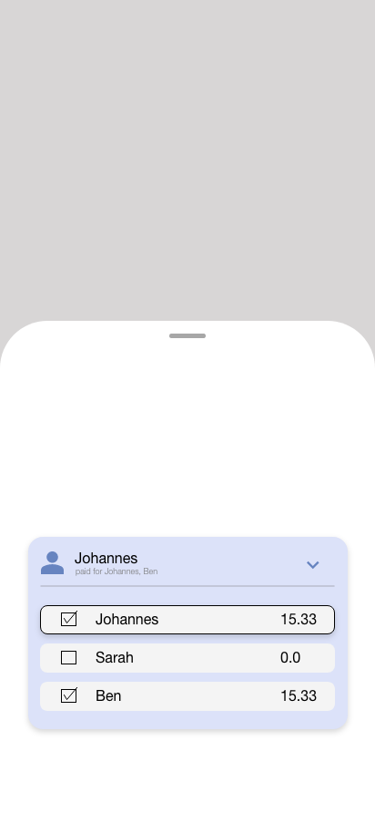

# Assignment 1 - expense tracker app

This app is designed to make it as easy as possible for users to keep track of their finances.
Here, the user has the possibility to enter his or her expenses and to view statistics and analyses
generated on the basis of this data.

## Additional Feature

The user has the option of sharing the cost of an expense with other persons.

### User story

1. User taps on the plus floating action button -> new expense form opens
2. User enters a amount in the amount text field
3. User taps on the left arrow icon button -> split form body expands -> PersonSplitListTiles are now visible
4. User taps on PersonSplitListTiles to select the person as the funder
5. User taps on the checkbox of a PersonSplitListTile to select/ unselect the corresponding person as a borrower
6. User fills out all split unrelated new expense form fields
7. User taps on the save button -> new expense form closes

### Documentation
external documents for the documentation of assignment 1

**Class diagram** [splitExpenseCostClassDiagram.pdf](documentation/splitExpenseCostClassDiagram.pdf)

**Wireframe**

